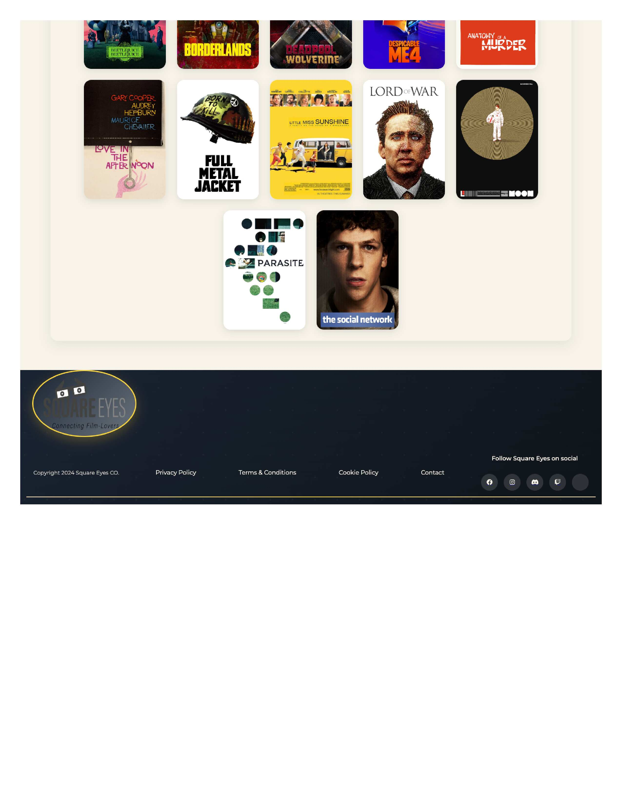

# Square Eyes – Film Discovery Website

## Project Overview

Square Eyes is a fictional streaming and movie browsing platform created as part of Noroff’s Front-End Development coursework. This was an individual project where the goal was to practice semantic HTML, structured layouts, reusable components, and visual hierarchy.

The site allows users to browse a curated list of movies, view detailed information about each title, and simulate purchasing or adding to a watchlist. The project emphasizes accessibility, clean structure, responsive layout, and visually engaging presentation.

---

## Links

- Live Site: [https://square-eyes-site.netlify.app](https://square-eyes-site.netlify.app)
- GitHub Repo: [https://github.com/sergiu-sa/pro-school-react](https://github.com/sergiu-sa/pro-school-react)

---

## Screenshots (Before vs. After)

### Old Design

  


### Updated Design

  


> These show the transition from the original student project to the final polished portfolio version.

---

## Tech Stack

- HTML5
- CSS3 (Responsive, Mobile-First)
- Vanilla JavaScript (for interactivity)
- Image optimization and lazy loading
- Netlify for deployment

---

## Features

- Hero banner with featured film
- Trending section with hover animations
- Movie cards with title, genre, and CTA
- Single product page with expanded information
- Functional layout for checkout and confirmation flow
- Reusable components with consistent styling
- Accessible HTML (alt text, semantic tags, landmarks)
- Mobile-friendly navigation and spacing

---

## Project Goals

- Practice clean, semantic HTML and structured CSS
- Create a visually balanced layout with clear hierarchy
- Ensure responsiveness across device sizes
- Begin introducing interactivity using vanilla JavaScript
- Showcase design skills through consistent, appealing visuals

---

## Folder Structure

```bash
square-eyes/
│
├── index.html                     # Homepage
├── src/
│   ├── pages/
│   │   ├── product/index.html     # Single movie page
│   │   ├── checkout/index.html    # Checkout flow
│   │   └── confirmation/index.html# Order confirmation
│   ├── css/
│   │   └── style.css              # Global styles (sectioned)
│   ├── js/
│   │   ├── main.js                # Homepage logic
│   │   ├── product.js             # Product logic
│   │   ├── checkout.js            # Checkout form validation
│   │   ├── cart.js                # Shopping cart logic
│   │   └── confirmation.js        # Final summary logic
```

---

## My Role

This was a solo project. I was responsible for:

- Creating the full HTML structure from scratch
- Designing and coding the layout and navigation
- Adding responsive styles and animations
- Organizing code into reusable sections
- Implementing accessibility features

---

## Current Status

The project is deployed and functional.  
Planned updates include:

- Better movie categorization and filtering
- Additional accessibility improvements
- Enhanced confirmation UX with animations

---

## Contact

- GitHub: [https://github.com/sergiu-sa](https://github.com/sergiu-sa)
